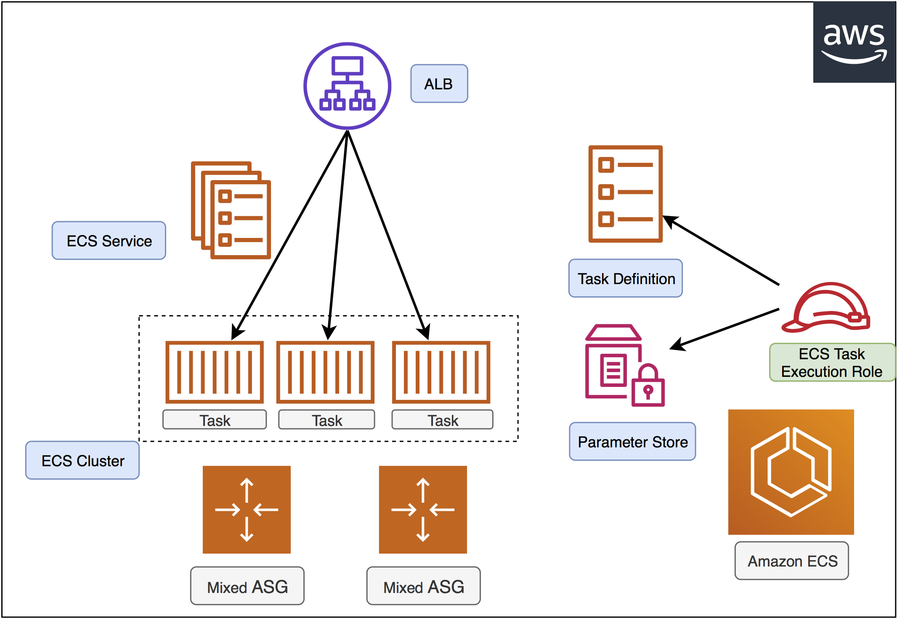
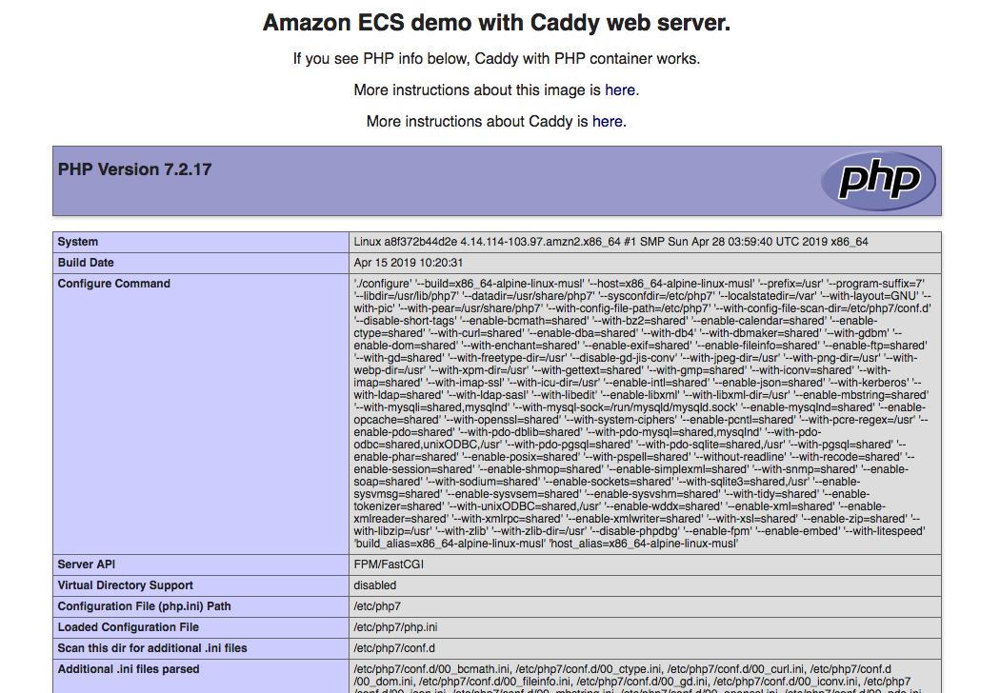

# ecs-cfn-refarch

This is an **Amazon EC2 Container Service** reference architecture with cloudformation templates that helps you provision a complete Amazon ECS environment with many advanced optional features.




## Features

- [x] Cluster provisioned with **mixed autoscaling group**(ondemand + spot instances diversified across many types and AZs)
- [x] Secrets saved in SSM **Parameter Store**
- [x] Using latest Amazon ECS AMI
- [x] Built-in **service autoscaling** policies and **cluster autoscaling** policies

# Usage

create a `custom.mk` file and customize your parameters in this file

```bash
$ cp custom.mk.sample custom.mk
$ vim custom.mk
```

Create the cluster

```bash
# create the cluster
$ make create-ecs-cluster
```

click the link to the cloudformation console. The whole stack should be created in 5–7minutes.

# Validate

When the cloudformation is completed. Check the stach output:

```bash
# check the stack output
$ make describe-ecs-cluster
```

Response

```json
[
    {
        "OutputKey": "GreetingURL", 
        "OutputValue": "http://ecsdemo-MAIN-1M6ASY034M08X-alb-2131750000.ap-northeast-1.elb.amazonaws.com/greeting.html"
    },  
    {
        "OutputKey": "URL", 
        "OutputValue": "http://ecsdemo-MAIN-1M6ASY034M08X-alb-2131750000.ap-northeast-1.elb.amazonaws.com"
    }
]
```

click the `URL` and you'll see the phpinfo page, wihch is served by ECS Tasks behind ALB.





If you cURL the `GreetingURL` , you'll get a static page containing credentials stored in SSM Parameter Store(i.e.`ECSYourName` and `ECSYourPassword`). The credentials were retrieved by ECS Execution Role from SSM Parameter on task bootstrapping and is injected into the environment variables.([details](https://github.com/pahud/ecs-cfn-refarch/blob/91424203d946561c6098992d67cc41d87de9ee89/cloudformation/service.yaml#L1312-L1314))

```bash
$ curl http://ecsdemo-MAIN-1M6ASY034M08X-alb-2131750000.ap-northeast-1.elb.amazonaws.com/greeting.html
<!DOCTYPE html>
<html>
<head>
<title>EC2 Parameter Store demo</title>
</head>
<body>
<p>
<h1>Hi DefaultName!</h1>
<p>
<h2>Your password is DefaultPassword!</h2>
```

