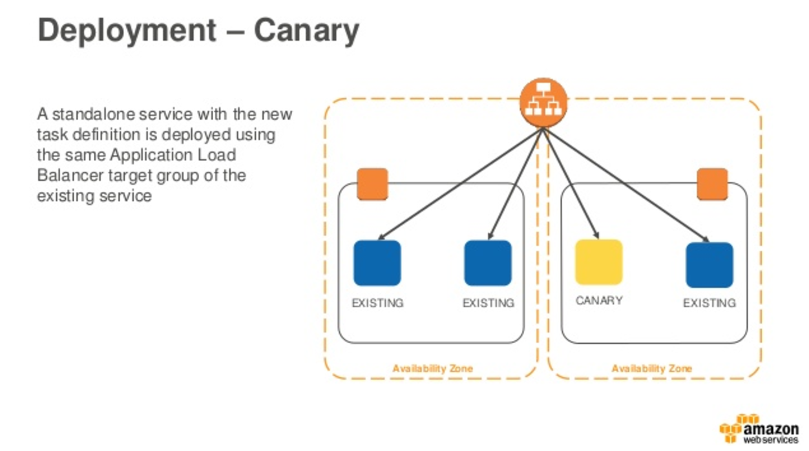
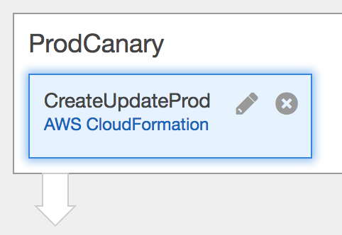
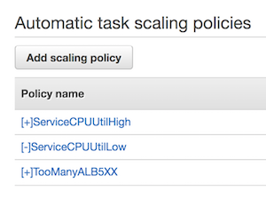
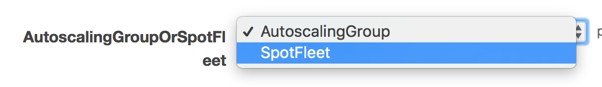
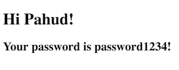

# ecs-cfn-refarch

This is a Amazon EC2 Container Service reference architecture with cloudformation templates that will provision a complete Amazon ECS environment with many advanced optional features:

1. standalone service-only Amazon ECS environment (simple provisioning)
2. Amazon ECS Windows Container(simpole provisioning)
3. Amazon ECS CI/CD with Code* and Cloudformation
4. Amazon ECS Service Autoscaling and ECS instances host Autoscaling triggered by Cloudwatch alarms
5. Log Consolidation with awslogs driver
6. Amazon ECS Events to CloudWatch Events and eventually go to SNS
7. Spot Fleet support
8. ASG scaling in triggering Amazon ECS container instance draining([link](https://aws.amazon.com/tw/blogs/compute/how-to-automate-container-instance-draining-in-amazon-ecs/))
9. credentials management with EC2 Parameter Store([link](https://aws.amazon.com/tw/blogs/compute/managing-secrets-for-amazon-ecs-applications-using-parameter-store-and-iam-roles-for-tasks/))
10. Amazon ECS Service registering both external ALB/TG and internal ALB/TG with Amazon ECS Events and AWS Lambda
11. **[new]** **[etcd3 cluster](https://coreos.com/etcd/docs/latest/v2/clustering.html) running on top of Amazon ECS cluster(3 nodes) and DNS SRV discovery**


## Lab1 - service-only 

This cloudformation template will provision common Amazon ECS infrastructure including:

- VPC, IGW, subnets, routing tables, security groups
- IAM role
- Autoscaling Group and Launch Configuration
- Lambda function as custom resource to query latest ECS AMI ID
- ECS Service, Cluster, Task Definition
- [Caddy](https://caddyserver.com/) as the default web server


click the button to launch the demo stack in *us-west-2*

[](https://console.aws.amazon.com/cloudformation/home?region=us-west-2#/stacks/new?stackName=ecs-refarch&templateURL=https://s3-us-west-2.amazonaws.com/pahud-cfn-us-west-2/ecs-cfn-refarch/cloudformation/service.yml)

check the cloudformation output and click the ***LoadBalancerURL*** link to see the result.


## Lab2 - Windows Container

For **Amazon ECS Windows Container**, please click the button below:

[](https://console.aws.amazon.com/cloudformation/home?region=us-west-2#/stacks/new?stackName=ecs-win-refarch&templateURL=https://s3-us-west-2.amazonaws.com/pahud-cfn-us-west-2/ecs-cfn-refarch/cloudformation/service-win-official.json)

### Notice

- By default this template will create spot instance(m3.medium). If you need on-demand instance instead, specify ***SpotPrice*** parameter to "**0**"


## Lab3 - complete stack for CI/CD with Amazon ECS

This lab will provision a ECS CI/CD environment with Canary deployment support(see slide [#36](https://www.slideshare.net/AmazonWebServices/building-a-cicd-pipeline-for-container-deployment-to-amazon-ecs-may-2017-aws-online-tech-talks#36) [#37](https://www.slideshare.net/AmazonWebServices/building-a-cicd-pipeline-for-container-deployment-to-amazon-ecs-may-2017-aws-online-tech-talks#37) [#38](https://www.slideshare.net/AmazonWebServices/building-a-cicd-pipeline-for-container-deployment-to-amazon-ecs-may-2017-aws-online-tech-talks#38))





#### 1. Fork the GitHub repository

[Fork](https://help.github.com/articles/fork-a-repo/) this GitHub repository(https://github.com/pahud/ecs-cfn-refarch) into your GitHub account.

From your terminal application, execute the following command (make sure to replace `<your_github_username>` with your actual GitHub username):

```
git clone https://github.com/<your_github_username>/ecs-cfn-refarch
```

This creates a directory named `ecs-cfn-refarch` in your current directory, which contains the code for the Amazon ECS sample app unser `src` directory.


#### 2. Create the CloudFormation stack

click the button to launch the demo stack in *us-west-2*

[](https://console.aws.amazon.com/cloudformation/home?region=us-west-2#/stacks/new?stackName=ecs-refarch-cicd&templateURL=https://s3-us-west-2.amazonaws.com/pahud-cfn-us-west-2/ecs-cfn-refarch/cloudformation/codepipeline.yml)


The CloudFormation template requires the following parameters:

- GitHub configuration
  - **CodeBuildEnvironment**: CodeBuild environment. 
  - **GitHubBranch**: The branch of the repo to deploy continuously. Leave it as default "master"
  - **GitHubRepo**: The name of the github repo to  deploy continuously. Leave it as default "ecs-cfn-refarch"
  - **GitHubToken**: Token for the user specified above. ([https://github.com/settings/tokens](https://github.com/settings/tokens))
  - **GitHubUser**: Your username on GitHub.
  - **ServiceName**: Your ECS Service name.
  - **UseCodeCommit**: If you use CodeCommit instead, select **"yes"** and ignore all GithHub parameters above.


#### 3. Trigger the CodePipeline for the 1st time

By triggering the CodePipeline for the 1st time, it will privision the Beta and Production environment for you.


After the 1st run of CodePipeline is completed, edit the CodePipeline, click the pencil icon of **ProdCanary** stage:




Click **Advance** and edit the **Parameter overrides**, remove the **"Tag": { …}** attribute and value, leaving other attributes as default:


#### 4. Trigger the CodePipeline for the 2nd time

Modify the ***src/index.php*** in the local repository, **git commit** and **git push** to the remote repository(github or codecommit). This will trigger the CodePipeline again. When the pipeline goes to the **ProdCanary** stage, it will update the Canary ECS service only, leaving the existing ECS service unchanged. And when it moves to **RemoveCanary** stage, it will updat the existing production ECS service with the same version as the canary and remove the canary ECS service completely(set the desired ECS task count of canary to 0).

###### Reference

Building a CICD Pipeline for Container Deployment to Amazon ECS - May… - https://www.slideshare.net/AmazonWebServices/building-a-cicd-pipeline-for-container-deployment-to-amazon-ecs-may-2017-aws-online-tech-talks


## Lab4 - Scaling from ECS Service Autoscaling

The Cloudformation template will generate a few Service Autoscaling policies for you:

.

## Scaling from Autoscaling Group

The Autoscaling Group will scale out when:

1. The **CPUUtilization** of EC2 instances within the Autoscaling Group is high
2. The **CPUReservation** of ECS Cluster is high
3. The **MemoryReservation** of ECS Cluster is high

**UPDATE** - This refarch will configure the hosts scaling policies just as [Expedia's sharing](https://twitter.com/pahudnet/status/858450488609480704) in AWS Summit Santa Clara 2016([video](https://youtu.be/7r4_Ne7v38o?t=30m53s)).

## Lab5 - Log consolidation

Amazon ECS supports many [docker log drivers](https://docs.docker.com/engine/admin/logging/overview/#supported-logging-drivers), by default, this refarch will use [awslogs](http://docs.aws.amazon.com/AmazonECS/latest/developerguide/using_awslogs.html) and output consolidated logs to Amazon CloudWatch Logs.


## Lab6 - ECS Events and SNS Notifications

All ECS Events from the ECS Cluster created by this cloudformation template will go to CloudWatch Events rule and then publish to SNS Topic. You can find the SNS Topic in the cloudformation outputs.


###### Reference

Monitor Cluster State with Amazon ECS Event Stream | AWS Compute Blog - https://aws.amazon.com/tw/blogs/compute/monitor-cluster-state-with-amazon-ecs-event-stream/


## Lab7 - Spot Fleet support

By default the ECS cluster in this refarch is provisioned by Autoscaling Group, alternatively, you can select **SpotFleet** in **AutoscalingGroupOrSpotFleet** cloudformation parameter.




When cloudformation provisions the ECS cluster with spot fleet, it will launch the spot instances with [Diversified Allocation Strategy](http://docs.aws.amazon.com/AWSEC2/latest/UserGuide/spot-fleet-examples.html#fleet-config5) with instances type *m3.medium*, *m4.large* and *c4.large*. With the diversity of instance types and multi-AZ allocation, you would not risk losing all ECS cluster with the spot price is lower than the market price - the spot fleet will maintain the desired capacity for you.


###### Reference

Powering your Amazon ECS Clusters with Spot Fleet | AWS Compute Blog - https://aws.amazon.com/tw/blogs/compute/powering-your-amazon-ecs-clusters-with-spot-fleet/

Powering your Amazon ECS Cluster with Amazon EC2 Spot Instances | AWS Compute Blog - https://aws.amazon.com/tw/blogs/compute/powering-your-amazon-ecs-cluster-with-amazon-ec2-spot-instances/


## Lab8 - ASG scaling in with ECS container instance draining

Check the following reference link. By launching this cloudformation stack with Autoscaling Group support, when Autosaling Group scaling in the instances, the Autoscaling LifeCycle event will trigger the Lambda function to perform ECS Container Draining in prior to the host termination by Autoscaling Group.

###### reference

How to Automate Container Instance Draining in Amazon ECS | AWS Compute Blog - https://aws.amazon.com/tw/blogs/compute/how-to-automate-container-instance-draining-in-amazon-ecs/


## Lab9 - credentials management with EC2 Parameter Store

By lauching the cloudformation template, it will provision an EC2 Parameter "**ECSYourName**" in Parameter Store for you alone with KMS Key and Alias(**alias/myEcsKeyAlias**).  To create a new parameter with KMS encrypted, try the following commands:

```
$ ssm put-parameter --name ECSYourPassword --value password1234 --type SecureString --key-id alias/myEcsKeyAlias
```

And you can specify the optional "**ECSYourName**" in the cloudformation input parameter.

When the stack is created, try open the teting URL:

```
http://Your_LoadBalancerURL_IN_CloudFormation_Output/greeting.html
```

and you should be able to see this:



you can check this bootstrap ***startup.sh*** to see how it generates the credentials within the ECS Task.
https://github.com/pahud/docker-caddy/blob/master/startup.sh

###### Reference

Managing Secrets for Amazon ECS Applications Using Parameter Store and IAM Roles for Tasks | AWS Compute Blog - https://aws.amazon.com/tw/blogs/compute/managing-secrets-for-amazon-ecs-applications-using-parameter-store-and-iam-roles-for-tasks/


## Lab10 - ECS Service registering both external ALB/TG and internal ALB/TG with ECS Events and Lambda

If you need to run an ECS Service registering both internet-facing ALB/TG and internal ALB/TG it's not supported yet. But you can have a workaround with ECS Events, CloudWatch Events and Lambda function listening the ECS Task Events and register/deregister the ALB Target Group.

###### [](https://console.aws.amazon.com/cloudformation/home?region=us-west-2#/stacks/new?stackName=lab10-ecs-refarch&templateURL=https://s3-us-west-2.amazonaws.com/pahud-cfn-us-west-2/ecs-cfn-refarch/cloudformation/lab10-dual-alb.yml)

### 

## Lab11 - etcd3 cluster with Route53 DNS discovery on ECS cluster

Running a **fully-managed etcd3 cluster** with **Route53 DNS discovery** with 3 nodes. This Lab will generate a 3-node ECS cluster and initialize a 3-node etcd3 cluster running on the ECS cluster. With ECS events,  the Lambda function will manage the Route53 DNS records dynamically with A record of each etcd3 node and **DNS SRV** record set for the cluster as well. Click the **Launch Stack** button below to bring up a new cluster in us-west-2.

[](https://console.aws.amazon.com/cloudformation/home?region=us-west-2#/stacks/new?stackName=etcd-cluster-ecs&templateURL=https://s3-us-west-2.amazonaws.com/pahud-cfn-us-west-2/ecs-cfn-refarch/cloudformation/lab11-etcd3.yml)


#### test script

```
#!/bin/bash

memberList(){
	docker run -ti quay.io/coreos/etcd:v3.2.1 \
	/usr/local/bin/etcdctl --discovery-srv etcd.local member list
}

testSet(){
	echo "=> testing set foo=bar"
	docker run -ti quay.io/coreos/etcd:v3.2.1 \
	/usr/local/bin/etcdctl --discovery-srv etcd.local set foo bar
}
testGet(){
	echo "=> testing get foo"
	docker run -ti quay.io/coreos/etcd:v3.2.1 \
	/usr/local/bin/etcdctl --discovery-srv etcd.local get foo
}

memberList
testSet
testGet
```

#### output

```
747a7d6b45c893e0: name=etcd-node3 peerURLs=http://etcd-node3.etcd.local:2380 clientURLs=http://etcd-node3.etcd.local:2379 isLeader=false
7a58bdb114d5c60b: name=etcd-node1 peerURLs=http://etcd-node1.etcd.local:2380 clientURLs=http://etcd-node1.etcd.local:2379 isLeader=false
b0fb63d26ddbc7b9: name=etcd-node2 peerURLs=http://etcd-node2.etcd.local:2380 clientURLs=http://etcd-node2.etcd.local:2379 isLeader=true
=> testing set foo=bar
bar
=> testing get foo
bar
```

